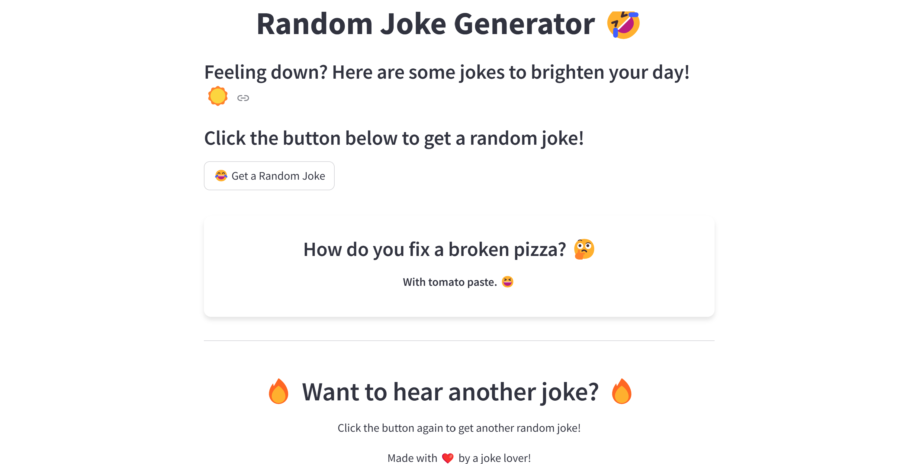

<h1 style="text-align: center;">🤣 Random Joke Generator 🤣</h1>

    
    

<h2>📌 Project Overview</h2>

This is a simple <strong>Random Joke Generator</strong> built with <strong>Streamlit</strong> and the <strong>Official Joke API</strong>. The app provides a fun way to lighten your mood with a new joke every time you press the button. 🎭

<h2>✨ Features</h2>
<ul>
    <li>🎭 Fetches random jokes from an API</li>
    <li>🎨 Beautiful UI with a <strong>gradient background & stylish buttons</strong></li>
    <li>🔄 Generates a <strong>new joke on button click</strong></li>
    <li>📱 Fully <strong>responsive design</strong></li>
</ul>

<h2>🚀 Installation</h2>
<ol>
    <li>Clone the repository:</li>
    <pre><code>git clone https://github.com/your-repo/random-joke-generator.git
cd random-joke-generator</code></pre>
    <li>Install dependencies:</li>
    <pre><code>pip install -r requirements.txt</code></pre>
    <li>Run the app:</li>
    <pre><code>streamlit run app.py</code></pre>
</ol>

<h2>🛠️ Technologies Used</h2>
<ul>
    <li><strong>Python</strong> 🐍</li>
    <li><strong>Streamlit</strong> 🚀</li>
    <li><strong>Official Joke API</strong> 🎭</li>
    <li><strong>Custom CSS Styling</strong> 🎨</li>
</ul>

<h2>📸 Preview</h2>

<h2>📝 Usage</h2>
<ol>
    <li>Open the app.</li>
    <li>Click the <strong>😂 Get a Random Joke</strong> button.</li>
    <li>Enjoy the joke! 🤣</li>
    <li>Click again for another one! 🔄</li>
</ol>

<h2>📬 Contact</h2>

💬 Feel free to reach out for improvements or suggestions!

Made with ❤️ for fun & laughter! 😆

